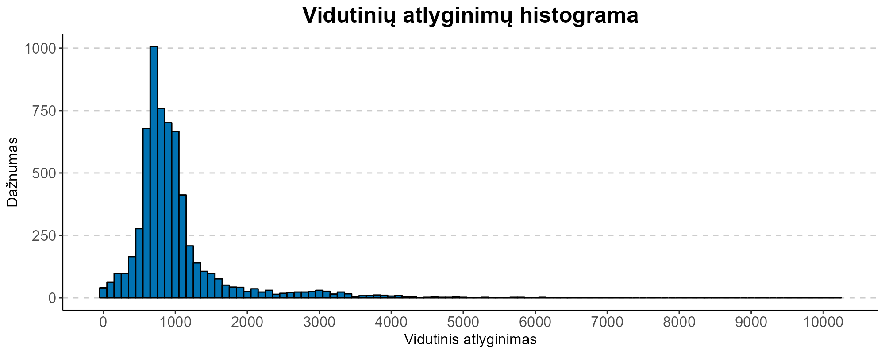

# R Laboratorinis darbas: duomenų vizualizacija

| Variantas | ecoActCode |
|-----------|------------|
| 12        | 451100     |

### 1. Užduotis

Matome, kad automobilių ir lengvųjų variklinių transporto priemonių pardavimo įmonių atlyginimai išsibarsę aplink 850. Dispersija šiek tiek ištempta į dešinę, bet to ir tikimės nagrinėdami atlyginimų duomenis.

### 2. Užduotis

Matome, kad UAB "Autovista", UAB "Mobility Fleet Solutions" ir UAB "Krone Scanbalt" atlyginimai patyrė didelius pokyčius atitinkamai kovo, balandžio ir rugsėjo mėnesiais. Galime įtarti, kad šiems staigiems pokyčiams padarė įtakos dosnios premijos, mokamos minėtais mėnesis, kadangi kitais stebėtais mėnesiais atlyginimai išliko stabilūs arba tolydžiai kilo leidosi. Konkretesnes išvadas galėtume daryti tik panagrinėję keletos metų duomenis. Taip pat reikėtų paminėti, kad "Aktsiaselts auto 100" atlyginimai per keturis stebėtus mėnesius padidėjo apie 50%.

### 3. Užduotis

Iš aukščiau minėtų įmonių daugiausia darbuotojų turėjo UAB " City Bee Solutions", kuri 2022-12 mėn. buvo apdraudusi 62 darbuotojus. Tuo pat metu "Aktsiaselts auto 100 Lietuvos filialas" turėjo vos 7 darbuotojus, "UAB Austovista" tik 6, Krone Scanbalt tik 15. Toks nedidelis apdraustų darbuotojų skaičius paaiškina šių įmonių vidutinio atlyginimo pokyčių jautrumą stebėtais mėnesiais.

### 4. Užduotis

Shiny R aplikacijos nuoroda: <https://sefleris.shinyapps.io/KTU_R_Shiny_Lab/> 

Shiny R aplikacijos nuotraukos:

  
